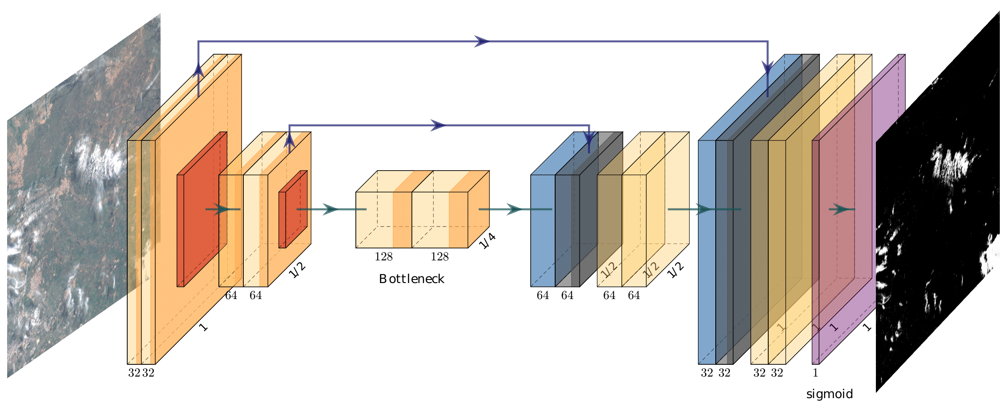

# Benchmarking Deep Learning models for Cloud Masking in Landsat-8 and Sentinel-2

This repository contains source code used in

> [1] López-Puigdollers, D., Mateo-García, G., Gómez-Chova, L. “Benchmarking Deep Learning models for Cloud Masking in Landsat-8 and Sentinel-2” Submitted [pre-print](https://arxiv.org/abs/xxxx.xxxxx)



## Requirements

The following code creates a new conda virtual environment with required dependencies.

```bash
conda create -n dl_l8s2_uv -c conda-forge python=3.7 tensorflow=2 matplotlib --y

conda activate dl_l8s2_uv

python setup.py install

```

## Inference Landsat-8 images

Expects an L1T Landsat-8 image from the [EarthExplorer](https://earthexplorer.usgs.gov/).
The `--landsatimage` attribute points to the unzipped folder with a GeoTIF image for each band.

```
python inference.py CloudMaskL8 --l8image ./LC08_L1TP_002054_20160520_20170324_01_T1/ --namemodel rgbiswir
```
The folder `./LC08_L1TP_002054_20160520_20170324_01_T1` will contain a GeoTIF with the cloud mask.

## Inference Sentinel-2 images

Expects an L1C Sentinel-2 image from the [OpenHub](https://scihub.copernicus.eu/dhus).
The `--s2image` attribute points to the unzipped `SAFE` folder. The `--resolution` attribute select the output resolution of the product (10, 20, 30 or 60)

```
python inference.py CloudMaskS2 --s2image ./S2A_MSIL1C_20160417T110652_N0201_R137_T29RPQ_20160417T111159.SAFE/ --namemodel rgbiswir --resolution 30
```
The folder `./S2A_MSIL1C_20160417T110652_N0201_R137_T29RPQ_20160417T111159.SAFE` will contain a GeoTIF with the cloud mask.


## Cite

If you use this work please cite:

```
 @article{mateo-garcia_transferring_2020,
	title = {Transferring deep learning models for cloud detection between {Landsat}-8 and {Proba}-{V}},
	volume = {160},
	issn = {0924-2716},
	doi = {10.1016/j.isprsjprs.2019.11.024},
	journal = {ISPRS Journal of Photogrammetry and Remote Sensing},
	author = {Mateo-García, Gonzalo and Laparra, Valero and López-Puigdollers, Dan and Gómez-Chova, Luis},
	month = feb,
	year = {2020},
	pages = {1--17},
}
```

## Related work

* [Multitemporal cloud masking in the Google Earth Engine](https://github.com/IPL-UV/ee_ipl_uv)
* [Landsat-8 to Proba-V transfer learning and Domain adaptation for cloud detection](https://github.com/IPL-UV/pvl8dagans)
